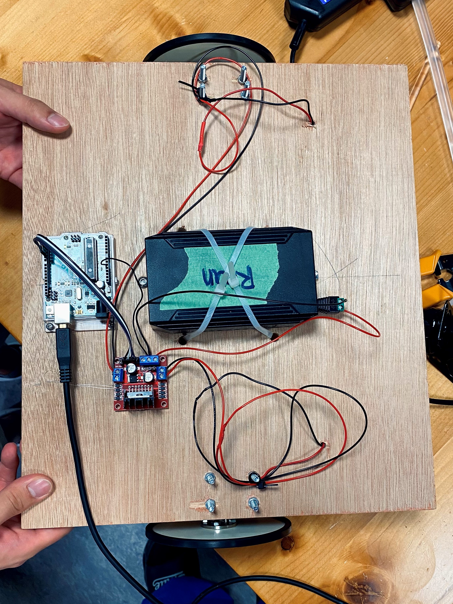
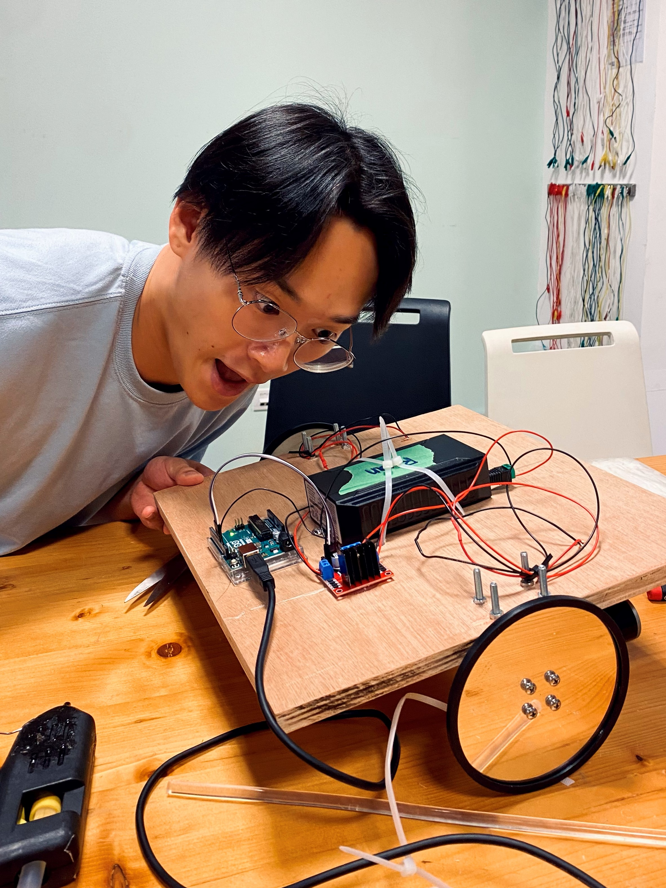

# Assignment 1 | First Robot

## Date: 9/12/2023:

For this first assignment, I teamed up with Ryan Wu. We based the concept of our first robot on the [_"larva"_ masks](https://www.nakupelle.com/masks/Resources/larvals1.gif), which are used in theater to make the audience focus on the moves of the actors rather than on their facial expressions. We took an ironic take by not adding any body extremity, so our robot is only a giant _"larva"_ face. 

 

## Date: 9/18/2023:

This week, my teammate and I constructed the base for our robot. The instructions were straightforward, so the only complication that we found was how slow we were doing things since it had been a while since we had used power tools. 

 

It was Ryan's first time soldering, so in order to practice and get familiar with the tools, he was in charge of soldering extension cables for our wires.

 

This is how our base looks thus far:


To make the motors move, I used [Prof. Michael Shiloh's code](https://github.com/michaelshiloh/PerformingRobots/blob/master/lectureNotes.md#todays-lecture) shown in his class _Performing Robots_.

```
void setup() {
  // Pins 2 and 3 are connected to In1 and In2 respectively
  // of the L298 motor driver
  pinMode(2, OUTPUT);
  pinMode(3, OUTPUT);
}

void loop() {
  // make the motor turn in one direction
  digitalWrite(2, LOW);
  digitalWrite(3, HIGH);
  delay(5000); // let it turn for 5 seconds

  // now reverse direction
  digitalWrite(2, HIGH);
  digitalWrite(3, LOW);
  delay(5000);
}

```

## Date: 9/20/2023:

 

 

```
void setup() {
  //right wheel
  pinMode(2, OUTPUT);
  pinMode(3, OUTPUT);
  //left wheel
  pinMode(4, OUTPUT);
  pinMode(5, OUTPUT);
}

void loop() {
  // going forward
  
  digitalWrite(2, LOW);
  digitalWrite(3, HIGH);
  digitalWrite(4, LOW);
  digitalWrite(5, HIGH);
  delay(500); // let it turn for 3 seconds

  //cha-cha-cha
  digitalWrite(2, LOW);
  digitalWrite(3, HIGH);
  digitalWrite(4, LOW);
  digitalWrite(5, LOW);
  delay(170); // let it turn for 3 seconds
  //////
  digitalWrite(2, LOW);
  digitalWrite(3, LOW);
  digitalWrite(4, LOW);
  digitalWrite(5, HIGH);
  delay(170); // let it turn for 3 seconds
  digitalWrite(2, HIGH);
  digitalWrite(3, LOW);
  digitalWrite(4, LOW);
  digitalWrite(5, LOW);
  delay(170); // let it turn for 3 seconds
  //////
  digitalWrite(2, LOW);
  digitalWrite(3, LOW);
  digitalWrite(4, HIGH);
  digitalWrite(5, LOW);
  delay(170); // let it turn for 3 seconds


  // going backward
  digitalWrite(2, HIGH);
  digitalWrite(3, LOW);
  digitalWrite(4, HIGH);
  digitalWrite(5, LOW);
  delay(500);


  //cha-cha-cha
  digitalWrite(2, LOW);
  digitalWrite(3, HIGH);
  digitalWrite(4, LOW);
  digitalWrite(5, LOW);
  delay(500); // let it turn for 3 seconds
  //////
  digitalWrite(2, LOW);
  digitalWrite(3, LOW);
  digitalWrite(4, LOW);
  digitalWrite(5, HIGH);
  delay(170); // let it turn for 3 seconds
  digitalWrite(2, HIGH);
  digitalWrite(3, LOW);
  digitalWrite(4, LOW);
  digitalWrite(5, LOW);
  delay(170); // let it turn for 3 seconds
  //////
  digitalWrite(2, LOW);
  digitalWrite(3, LOW);
  digitalWrite(4, HIGH);
  digitalWrite(5, LOW);
  delay(170); // let it turn for 3 seconds
}
```
