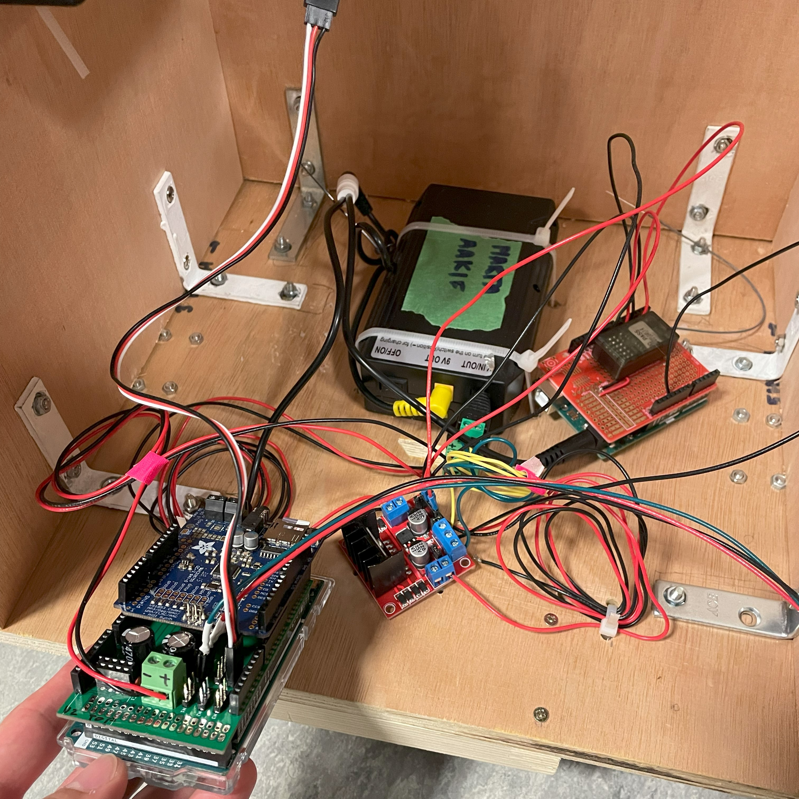

# WEEK 10-12 |

## Date: 11/04/2023 |

We were instructed to start working on what we think will be the most challenging part of building our robot. For our robot's mechanism, three boxes stacked on top of each other that rotate independently, we were advised to use "lazy Susans," which will help us distribute the weight of the boxes over more surface to make the rotation smoother. Today, we prototyped how to use the lazy Susans with the servomotors and cardboard. Thus far, we haven't implemented the code yet to make the servomotors work.

## Date: 11/06/2023 |

Today, we got to test the functioning of our prototype and used a sample code from Arduino to control the motors. [You can click here to see how it works](https://youtube.com/shorts/C_zs0Bi7PgA?feature=share).

Since it worked fine, we moved to start building the actual base for one of the boxes with wood and MDF.

## Date: 11/08/2023 |

We finished the rest of the first box, screwing it onto the base that we had previously built

## Date: 11/10/2023 |

We repeated the same process for the second box, encountering an issue: the weight of the box didn't allow the second box to move correctly anymore. However, the professor recommended not to screw both sides of the lazy Susan onto the boxes, only one, which actually fixed the issue.

## Date: 11/12/2023 |

We reinforced the box vertices with pieces of wood.

## Date: 11/25/2023 |

After finishing the physical components of our robots, we moved to focus on the wires for the different parts: servomotors, Music Maker shield, and Arduino Uno and Mega. Most of our efforts today went into soldering the wires and making sure that the connections were functioning. 

[This is the code we used to make sure that each part of the body could move](code/body_moves.ino). We couldn't capture it on video since it was not working as we wanted, which took us the entire class time to fix. [The professor suggested this other code](code/servomotors.ino), which gave us a hint on how to continue next class.

## Date: 12/01/2023 |

Today, we ensured that both the Arduino Uno and Mega could work simultaneously. Additionally, we commenced working on implementing states with the transmitter, aiming for at least three different states. We encountered multiple issues that we anticipate will require some time to address, including correcting the Neopixel displays and coordinating the body movements and the wheels. Finally, we successfully configured the Music Maker shield to function and controlled it using states.

[This is what it looks like in video.](https://youtube.com/shorts/vNkDtDirt8A?feature=share)

