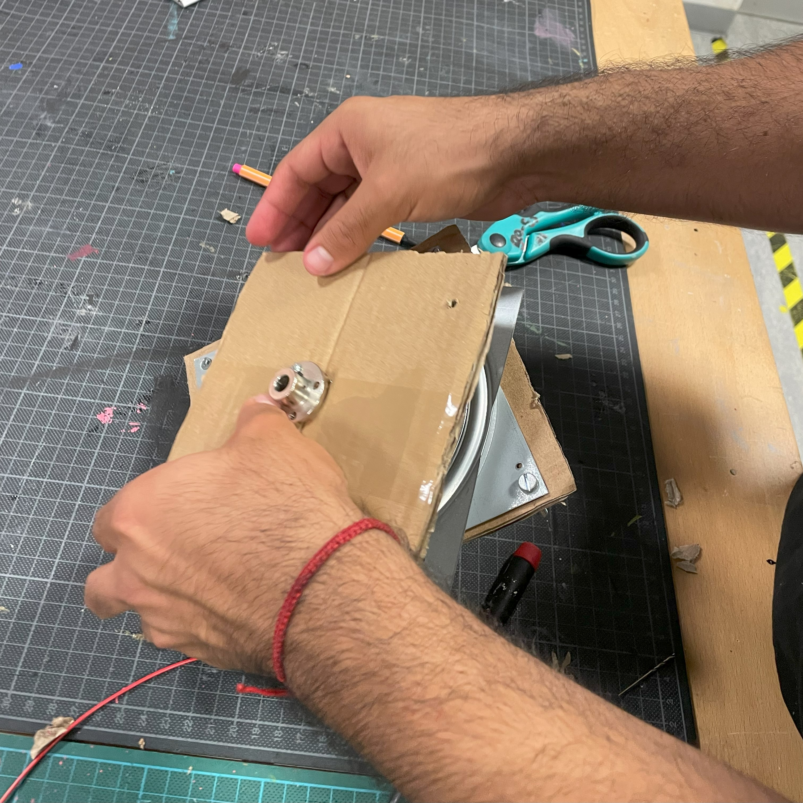
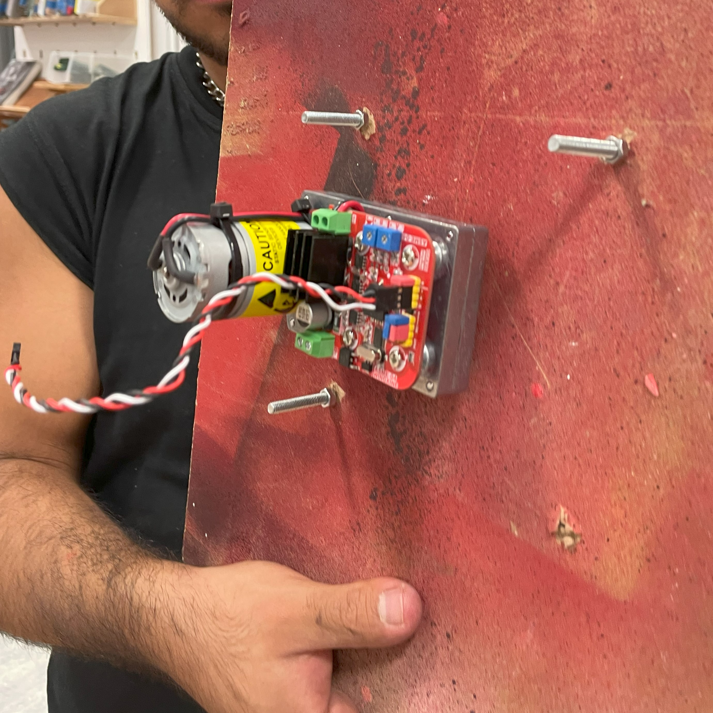
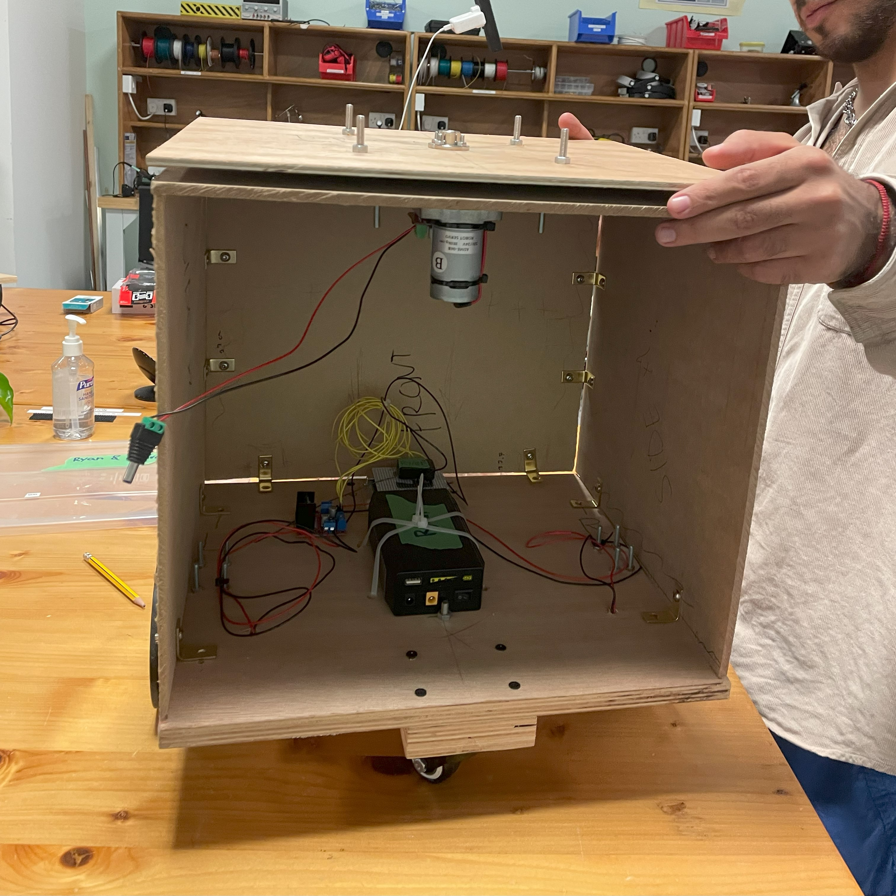
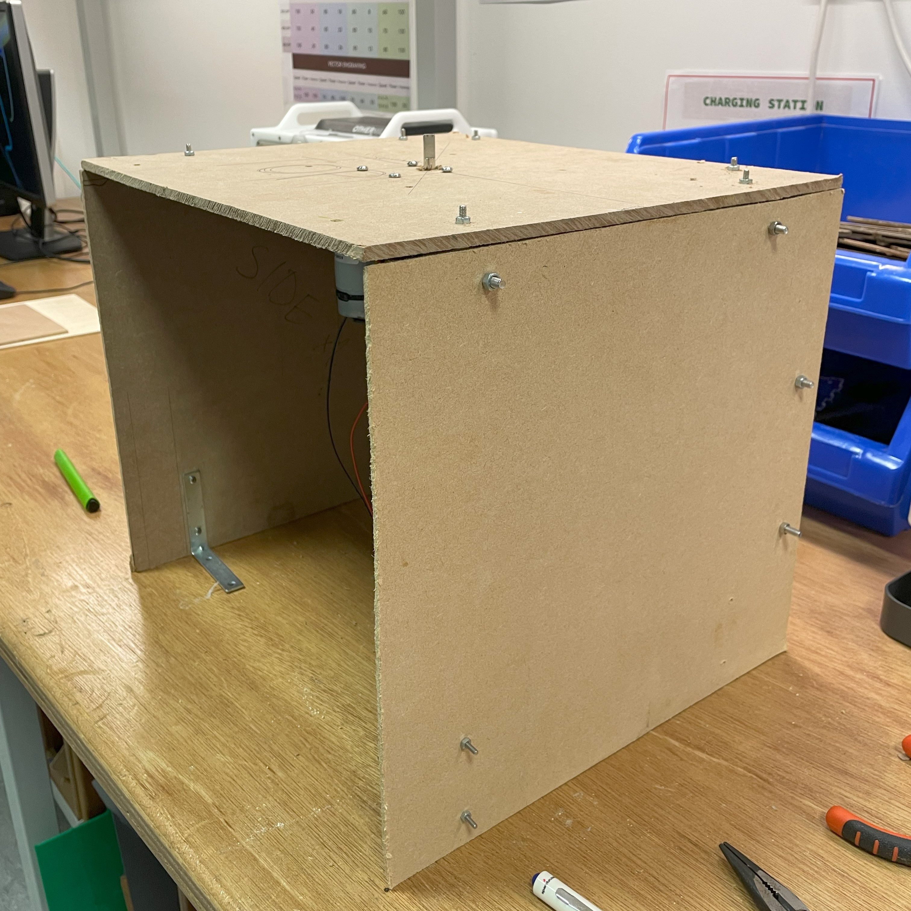
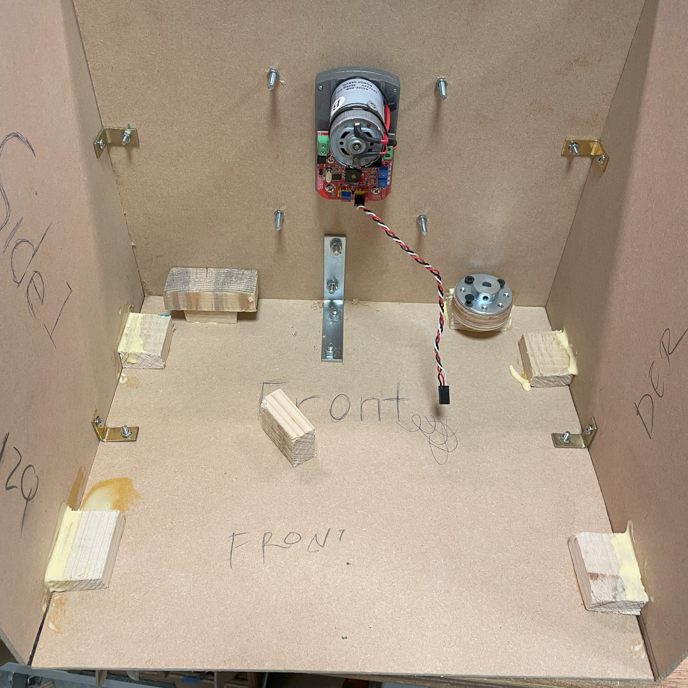

# WEEK 10-12 |

## Date: 11/04/2023 |

We were instructed to start working on what we think will be the most challenging part of building our robot. For our robot's mechanism—three boxes stacked on top of each other that rotate independently—we were advised to use "lazy Susans," which will help us distribute the weight of the boxes over more surface to make the rotation smoother. Today, we prototyped how to use the lazy Susans with the servomotors and cardboard. Thus far, we haven't implemented the code yet to make the servomotors work.

## Date: 11/06/2023 |

Today, we got to test the functioning of our prototype and used a sample code from Arduino to control the motors. Since it worked fine, we moved to start building the actual base for one of the boxes with wood and MDF.

## Date: 11/08/2023 |

We finished the rest of the first box, screwing it onto the base that we had previously built

## Date: 11/10/2023 |

We repeated the same process for the second box, encountering an issue: the weight of the box didn't allow the second box to move correctly anymore. However, the professor recommended not to screw both sides of the lazy Susan onto the boxes, only one, which actually fixed the issue.

## Date: 11/12/2023 |

For this day, we noticed that since the bottom base is going to be sustaining the most weight at the bottom, therefore, we thought that it was important that the sides do not cave inwards. Hence, we decided to add some small pieces of wood and stick it to the adjacent parts of the cardboards that were connected to each other (as shown in the pictures). We completed this by using the wood glue in the lab in order to make sure that they will stick firmly. We concluded our day with this task. 

## Date: 11/14/2023 |

For today, as we have finally finished building the two major parts of our body base, we shifted our focus for today onto figuring out all the proper wiring for the power for all the different parts: Arduino Mega & Uno, Servo Shield, Music Maker shield, Servomotors' power and pins, etc. 

It was extremely confusing for us to understand what goes where and how and why it goes there at first. What made it worse was that there were no other group's robots where we could use as reference either because they weren't using two big servomotors like us or some were not at the same working stage as us yet. However, we managed to find a group's robot as reference: thank you Marta and Aakif! Even though their group only used one small servomotor, we were able to easily understand how and why they wired every single part of their robots and we applied this logic back to our own robot. 

Even though it took quite a while to figure things out, we were able to vaguely figure out what and how we had to wire everything up for our robot. We concluded our day by figuring out a vague idea how we had wire everything up and started a bit first. 

## Date: 11/18/2023 |

Today, I am so glad to say that Andres and I are finished with all the wiring for the servomotors as well as the Arduino Mega, Servo Shield and the Music Maker shield. We also made sure that both the Arduino Uno and Mega, H-Bridge, and the Marshall speaker were all working. 

The only tricky part we encountered and seeked advice from the Professor was how to provide provide power from one head of the battery to both the Arduino UNO and Mega as they both shared the same power source. The Professor provided us with a simple solution: to simply connect the head to two wires (positive and negative) to another head that will be plugged into the battery. Simply enough, it worked!

We concluded today by finishing wiring up the servomotors, Arduino UNO and Mega, and the Servo shield and Music Maker shield. We also made sure to organize the wires in a way that it doesn't get tangled on the ground by the wheels when it's moving around. 

Going foward, Andres and I are planning to double check that we can drive the robot around using the RC and starting to work on the Neopixels by connecting them togther and attaching them onto the head of our robot.

## Date: 11/19/2023 |

For this day, Andres and I focused mainly on making sure that both servomotors are able to turn successfully without any interferences. After a while of working and tinkering, we were able to make sure that the two servomotors turned successfully on its own. 

Furthermore, we also decided to test out the remote controller still works and could control the wheel movements. As expected, it was working perfectly fine as we could move it forwards, backwards, and even turning left and right. 