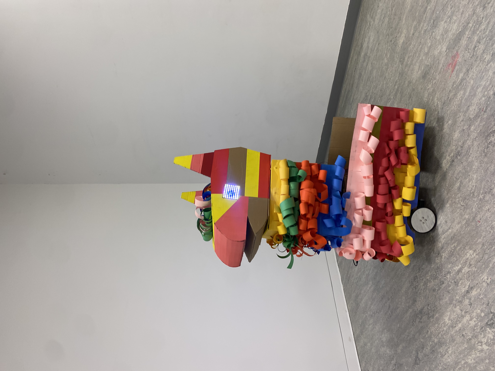
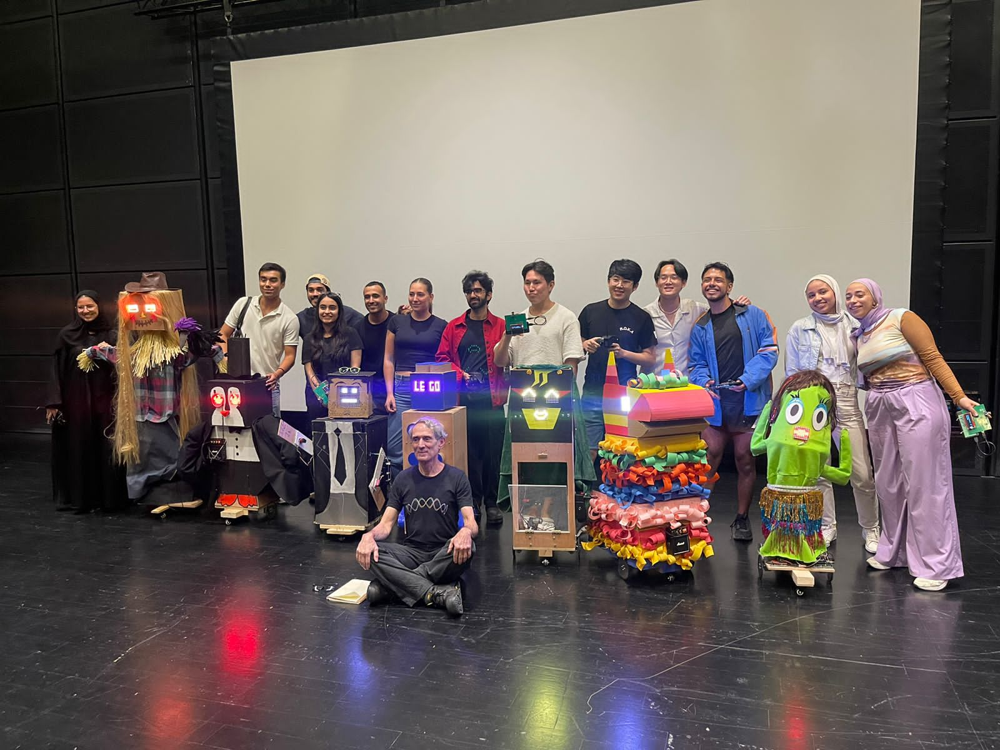

# WEEK 13-14 |

## Date: 11/04/2023 |

This week, we worked on refining details to optimize our robot's performance for the upcoming presentation. Collaborating with Professor Shiloh, we reinforced the base of the neck to prevent it from becoming loose during movement. We achieved this by adding a piece of aluminum, providing a larger contact surface for the hub.

Furthermore, we completed setting up the media elements for the code, including dialogues for the .mp3 files that I recorded using my voice and edited on Audacity. Additionally, we designed the eyes for the robot that will be displayed on the Neopixel. Finally, we modified the code that controls the wheels to adjust the speed based on the analog values detected by the sensor. [This is the code that we implemented.](code/radio_controls_wheels.ino)

## Date: 11/10/2023 |

Today, we finalized the states of the robot for the performance and implemented the design of the eyes, which are animated by adding a delay between each image displayed. [This is the code that we used](code/transmittercode.ino).

[Click here to see what the robot looks like now!](https://youtube.com/shorts/zadwNpcVt58?feature=share)

## Date: 11/13/2023 |

After completing the previous sections and ensuring that both the hardware and software were functioning correctly, we finished decorating Alejandro, the piñata. This is what it looks like now :)

## Date: 11/15/2023 |

We performed at the black boxed today! The audience was very cheerful and Alejandro received a lot of love, which was very rewarding for Ryan and I.

[Click here to see a bit of Alejandro's performance](https://youtube.com/shorts/_ElCyDBYOMM?feature=share)

## Final reflections |

I allow myself to be informal to convey the love-hate relationship that I developed with Alejandro. Being new to the world of robotics, the idea of creating a robot from scratch was intimidating, and at the beginning of the semester, I found myself questioning my partner's and my ability to fulfill our ambitions. I can see a significant contrast between how I initially worked with tools, slowly and confused, at the beginning of the semester and the confidence I gained in the last weeks of the course. Tasks that I now perceive as simple, such as soldering, coding the Arduino, or connecting wires, were very stressful at first. Despite the somewhat painful learning process, I am grateful for this experience. I would take this course again, as I now feel confident in extending this knowledge to other forms of robotics in the arts. I find it exciting to explore ways to integrate this knowledge into my Capstone project, allowing Alejandro's spirit to manifest in various ways.
