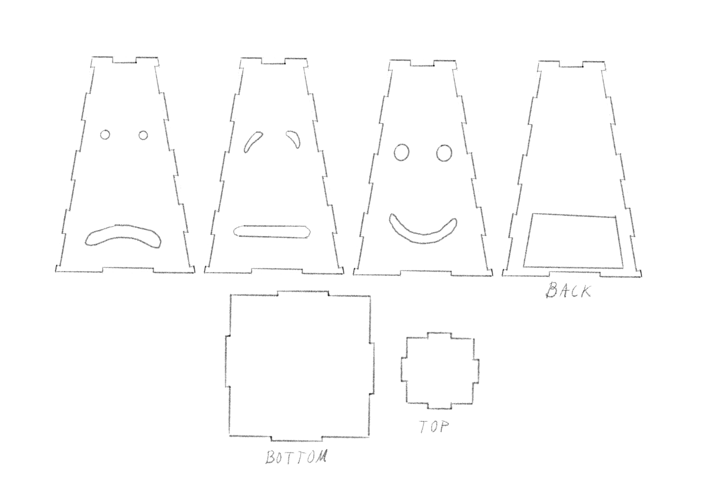

# WEEK 3 | Sept, 11 & 13

## Date: 9/13/2023 |

For this first assignment, I teamed up with Ryan Wu. We based the concept of our first robot on the [_"larva"_ masks](https://www.nakupelle.com/masks/Resources/larvals1.gif), which are used in theater to make the audience focus on the moves of the actors rather than on their facial expressions. We took an ironic take by not adding any body extremity, so our robot is only a giant _"larva"_ face. The robot will be, as instructed by our professor, 90 cm tall.

 