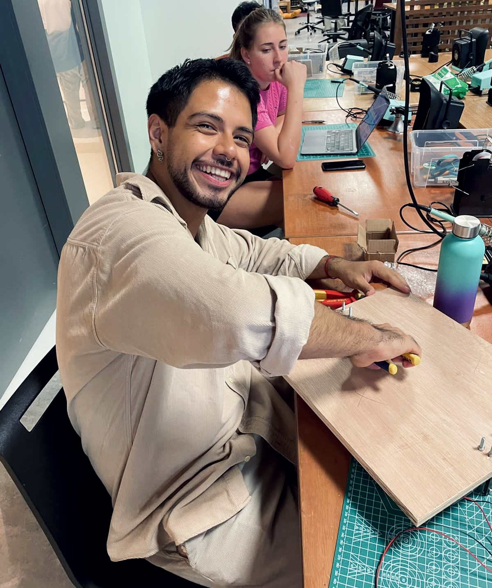
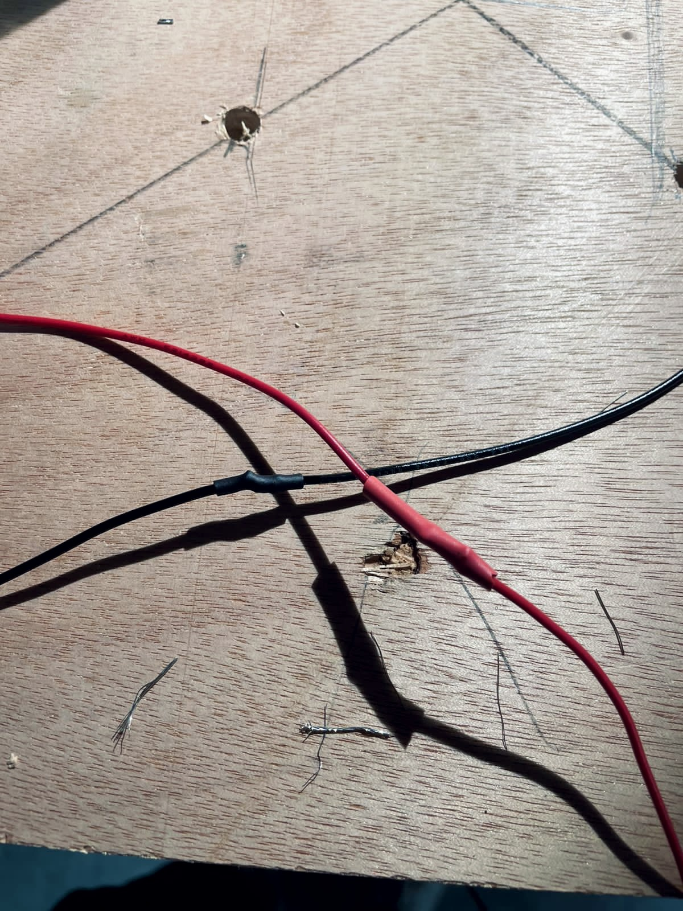
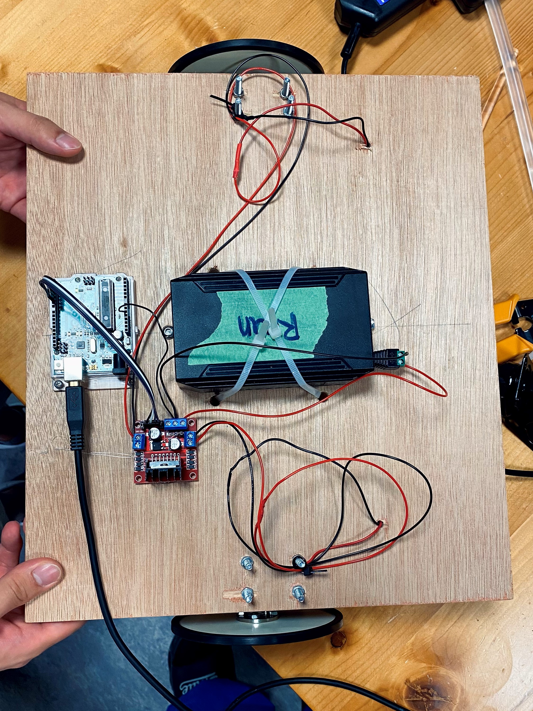
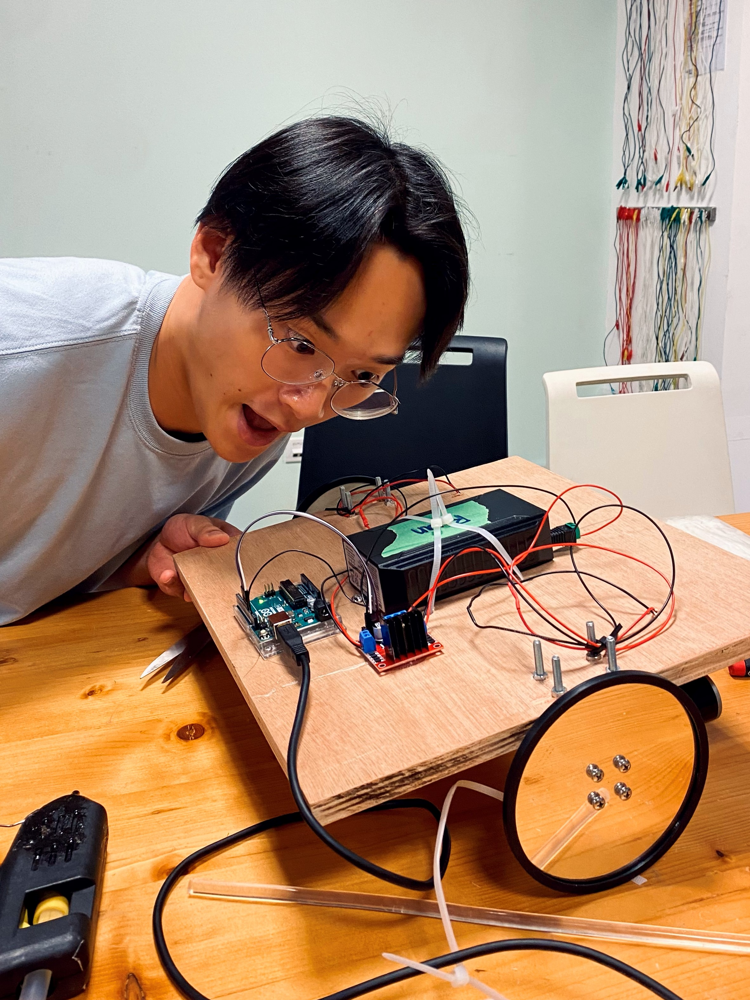

# WEEK 4 | Sept, 18 & 20

## Date: 9/18/2023 |

This week, my teammate and I constructed the base for our robot. The instructions were straightforward, so the only complication that we found was how slow we were doing things since it had been a while since we had used power tools. 

 

It was Ryan's first time soldering, so in order to practice and get familiar with the tools, he was in charge of soldering extension cables for our wires.

 

This is how our base looks thus far:

  

To make the motors move, I used [Prof. Michael Shiloh's code](https://github.com/michaelshiloh/PerformingRobots/blob/master/lectureNotes.md#todays-lecture) shown in his class _Performing Robots_.

```
void setup() {
  // Pins 2 and 3 are connected to In1 and In2 respectively
  // of the L298 motor driver
  pinMode(2, OUTPUT);
  pinMode(3, OUTPUT);
}

void loop() {
  // make the motor turn in one direction
  digitalWrite(2, LOW);
  digitalWrite(3, HIGH);
  delay(5000); // let it turn for 5 seconds

  // now reverse direction
  digitalWrite(2, HIGH);
  digitalWrite(3, LOW);
  delay(5000);
}

```

[You can click here to see on YouTube how it works!](https://youtu.be/RhFDEKh6y_A)

### Response to _Chapter 7: Machines/Mechanicals_ from the book _Entangled: Technology and the Transformation of Performance_ by Chris Salter

Chapter 7 of Chris Salter's book explores machine performance with some intriguing aspects that captivated my attention. Firstly, the concept of the Survival Research Lab's perception of machine performance challenged my view of machines as lifeless tools by offering a deep perspective on human's relationship with technology. The Lab's works respond to the idealized visions of technology from the past, placing it in the context of modern warfare technology. The Lab's standpoint was ambiguous since it was not clear whether it praises or criticizes post-industrial systems, but it's reflective of our ambivalence towards progress. Secondly, the chapter also explores the relatability of humans to robots, highlighting that it's through behavioral aspects and not appearance that we find a connection to technology. This idea extends to non-anthropomorphic robots like Wall-E, showcasing how actions and perceived emotions resonate with audiences. This concept applies to various mediums, emphasizing the importance of intentions behind creations in storytelling.

In conclusion, these aspects prompt us to reevaluate our relationship with technology and performance. They encourage experimentation in technology-driven art, highlighting the significance of actions and intentions. Salter's exploration urges us to examine our role in the post-industrial era's machinery and its impact on our perceptions of the mechanical and digital.


---

## Date: 9/20/2023 |

For today's assignment, we were instructed to make our robot dance. You can click [here to see the Arduino code](code/Performing_Robots-dancing_robot.ino), and [here to watch on YouTube](https://youtube.com/shorts/4NdlYkTO_-k?feature=share) how it looks in real life!
