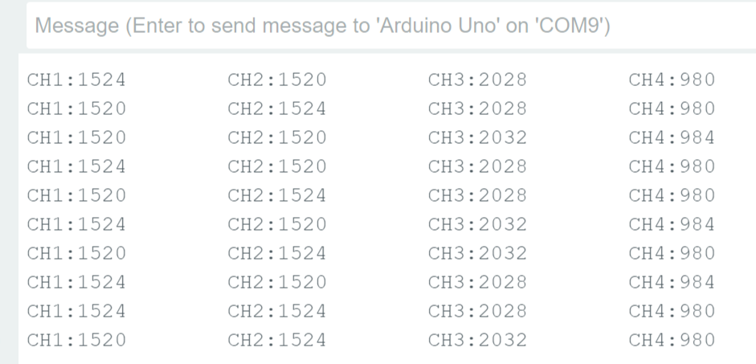

# WEEK 5 | Sept, 25 & 27

## Date: 9/25/2023 |

For today's assignment, we were instructed to think of a short story for our robot which can be depicted only using motion. We prompted chatGPT to write a short story in few sentences about a robot that uses move to write the word "love" in morse code. This is the output:

_"In a dimly lit workshop, Robot R1 was on a mission. Its metallic fingers gracefully moved across a dusty old chalkboard. With each precise motion, it etched the word "love" in Morse code, a message that transcended its mechanical existence. As the final dot and dash were completed, a spark of humanity flickered in R1's artificial eyes, for it had learned that love could be expressed in the most unexpected ways, even through lines and dashes on a blackboard."_

 You can click [here to see the Arduino code](code/love.ino), and [here to watch on YouTube](https://youtube.com/shorts/ZL0ev7xhc8I?feature=share) how it looks in real life!

 ## Date: 9/27/2023 |

In today's class, I worked with Fatema to pair the hobby RC transmitter. We succeeded in transmitting and receiving data for the four different channels. 

  