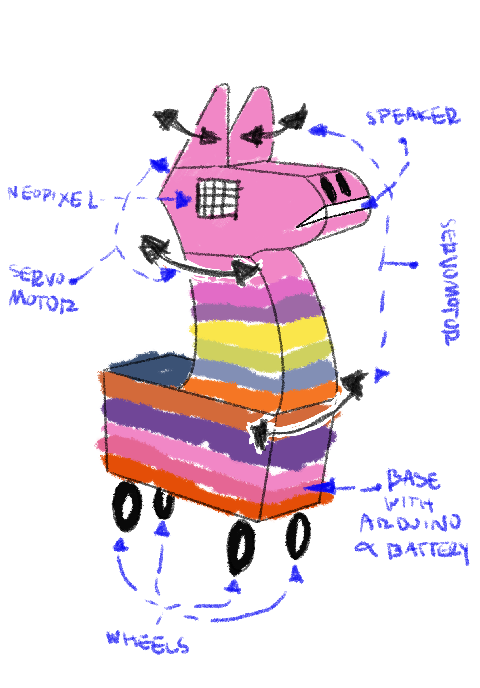
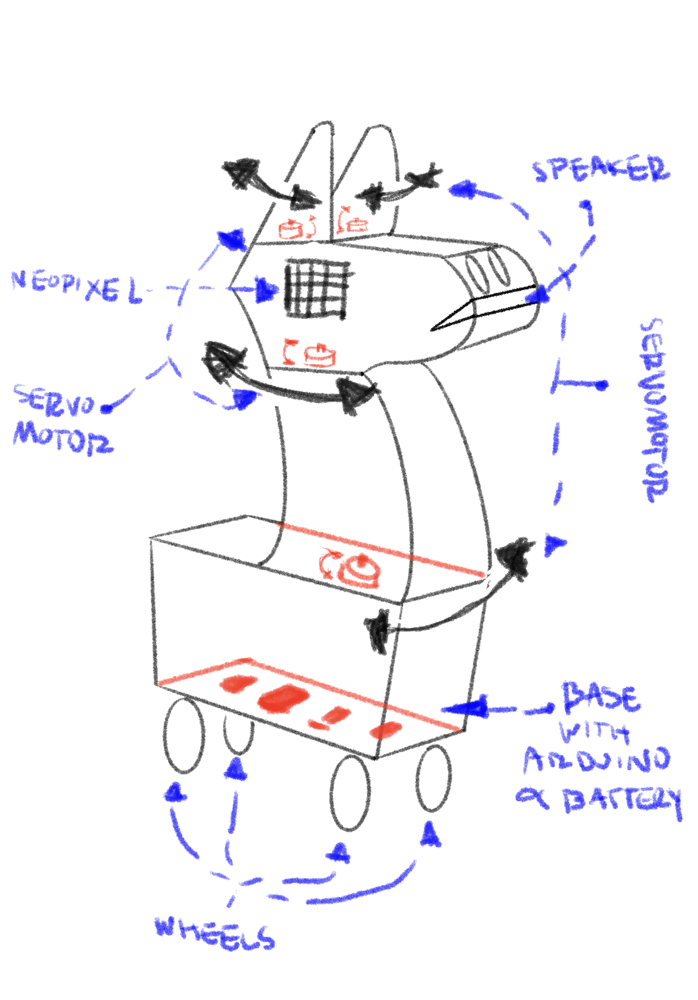

# WEEK 9 | Oct 28

## Date: 10/28/2023 |

The assignment for this week was to work collectively on [the script for the final project's play.](https://docs.google.com/document/d/1nOEF6REy5CgL2KIhYRLTIqgwFIGuVX1MHaLyYVF0rk8/edit)

As well, each team had to sketch the design for their robot. This what Ryan and I thought of for our _"Latino Robot"_:

  

Finally, we were instructed to finish individually one of the writing assignments. Here, you can find a virtual copy of my essay [_"Of Sisyphus, Robots and Absurdism"_](https://github.com/andresugartechea/PerformingRobots/blob/main/week_9/first_essay/Paper%20-%20Of%20Sisyphus%2C%20Robots%20and%20Absurdism.pdf), where I study the intersection between Kachi Chan's and Albert Camus' interpretation of the mythological character Sisyphus. You can also find here the link to [the presentation](https://github.com/andresugartechea/PerformingRobots/blob/main/week_9/first_essay Presentation%20-%20Of%20Sisyphus%2C%20Robots%20and%20Absurdism.pdf) I delivered in my class to further explain the concept of my paper.
